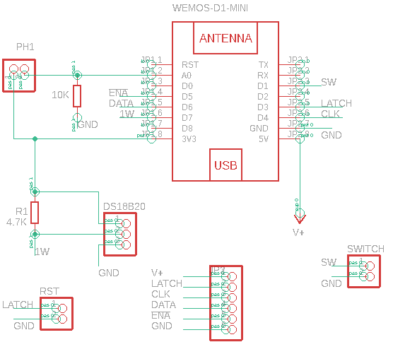
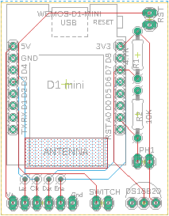

# FREEkvens

Use of a [IKEA Frekvens](https://www.ikea.com/fr/fr/p/frekvens-eclairage-a-led-multifonction-noir-30420354/) and a ESP8266 to:

- Display time as [Freebox](https://www.free.fr) server with number change animation.
- Display temperature

## Detailed features

- Display time thanks to NTP with DST support
- Display temperature
- Switch between display with device button
- Dynamic brigthness according to current light
- Configuration via WebSite for :
  - Wifi Settings (IP@, DNS name)
  - Time settings : timezone and NTP server
  - Other settings : dynamic or static brigth
- OTA support for update

## Hardware

### Setup

To dismantle the IKEA device I followed steps described [here](https://imgur.com/gallery/OBj0aC7) and everything goes smoothly ;-)

### Schema

Here's the electrical scheme use for setup.

### Board

I also designed the following board.

Source in EAGLE format are available in 'Hardware' folder as well as Gerber file.

## Installation

- Get source code
- Open with PlatformIO
- Build and upload to ESP8266
- Upload static file with command `Upload File System Image`
- Select IKEA-XXXX SSID and password is adminXXXX
- Open your web browser and enter <http://192.168.4.1>
- Configure Wifi Settings (SSID, username, password, DnsName)
- You can now access to web interface either at http://ip or  http://DnsName.local

## Version v1.0

### Limitations, known issues

- Animation is not exactly the same than the Freebox : when two digits change, both move on the box on my implementation they move one after the other.
- Delay in getting time from NTP server at startup, display 01 00 as time for about 1min (sync intervall)

## Source of inspiration, aknowledgments

MANY, MANY thanks to [frumperino] (https://github.com/frumperino)for its library to manage display on the device and [fairecasoimeme](https://github.com/fairecasoimeme) for the idea and great base for web based config interface and useful info on hacking the device

- [Frekvens Panel lib](https://github.com/frumperino/FrekvensPanel)
- [Implementation of fairecasoimeme](http://faire-ca-soi-meme.fr/hack/2020/07/31/hack-ikea-frekvens-panel-esp8266/)

## Disclaimer

No advertising neither for IKEA nor for FREE in this hack. Just the wish to share.
